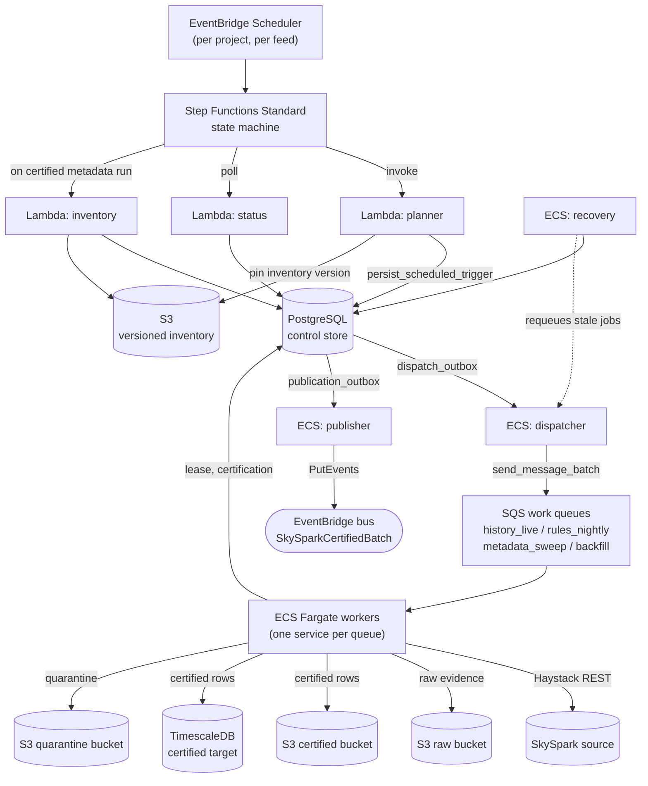
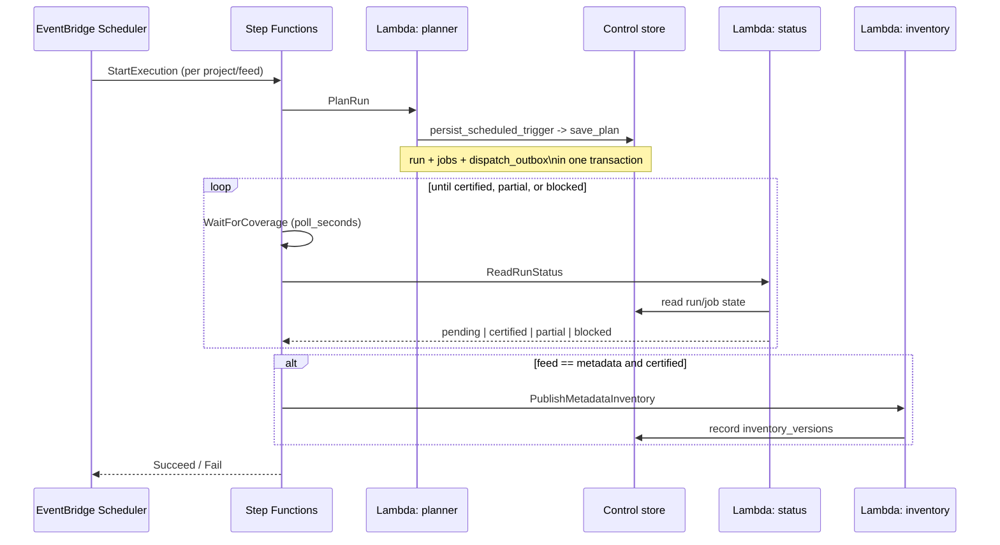
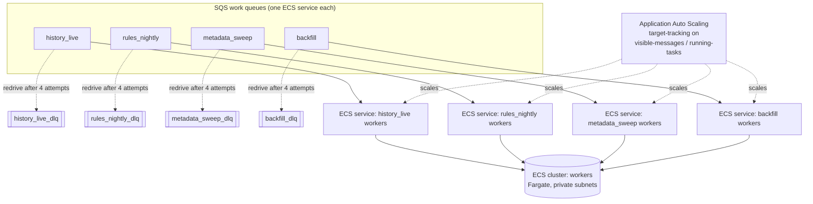
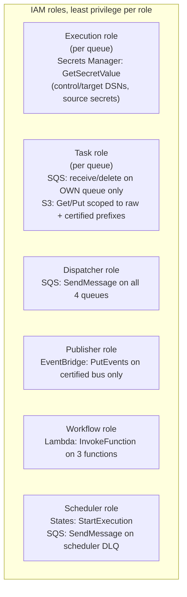

# AWS Production Architecture

**Status:** Reference documentation, derived from the current Terraform and application code
**Scope:** How the SkySpark ingestion worker platform is designed to run in AWS. The Terraform under `infra/` provisions these resources, but `enable_workers` and `enable_control_services` currently default to `false` and nothing has been applied to a live account. This document describes the design as implemented in code and configuration, not a running system.
**Companion document:** [local-development-architecture.md](local-development-architecture.md) describes the equivalent local stack.

## 1. Purpose

The AWS deployment turns the same worker platform used locally into a scheduled, autoscaling, multi-tenant ingestion system. Three Lambda functions and a Step Functions state machine handle orchestration; ECS Fargate services handle the bounded, queue-driven work; a PostgreSQL control store and a TimescaleDB target hold state and certified history; S3 holds immutable raw evidence and certified batch data. Every component is scoped by Terraform to the exact resource names declared in `resources.yaml`, enforced through preconditions that fail the plan if the two drift apart.

## 2. Terraform module layout

| Module | Provisions |
| --- | --- |
| `infra/foundation` | KMS key, S3 buckets (raw, certified, quarantine), ECR repositories, optional VPC interface/gateway endpoints |
| `infra/workers` | ECS cluster, SQS work queues and dead-letter queues, IAM roles, worker task definitions and services, autoscaling, alarms, and the three control-plane services (dispatcher, publisher, recovery) |
| `infra/orchestration` | Three Lambda functions (planner, status, inventory), the Step Functions state machine, EventBridge Scheduler group and role, and orchestration-level alarms/dashboard |

## 3. End-to-end topology

Every arrow into or out of the control store passes through the transactional-outbox pattern: a row is written in the same database transaction that changes state, and a separate, independently scaled service (dispatcher or publisher) is responsible for actually delivering it to SQS or EventBridge. This decouples "the work was planned" from "the work was announced," so a crash between those two steps cannot lose or duplicate a delivery.

## 4. Orchestration: schedule, plan, poll, publish

The state machine (`build_workflow_definition`, mirrored in `infra/orchestration/workflow.asl.json.tftpl`) has five meaningful states: `PlanRun`, `WaitForCoverage`, `ReadRunStatus`, `EvaluateCoverage`, and — only for a certified metadata run — `PublishMetadataInventory`. A `partial` or `blocked` status fails the execution outright rather than retrying silently, so a stuck or degraded run surfaces as a CloudWatch alarm instead of looping forever. All three Lambda invokes retry transient AWS SDK and Lambda service errors with exponential backoff before failing the execution.

Per-project, per-feed schedules are not static Terraform resources — the module provisions the schedule group, IAM role, and dead-letter queue that schedules will use, and `skyspark-schedules reconcile --apply` creates and reconciles the individual EventBridge Scheduler entries at runtime, detecting drift against the desired state each time it runs.

## 5. Job lifecycle: plan to certification

```mermaid
flowchart LR
    PLAN["plan_run\n(deterministic,\ncontent-addressed IDs)"] --> SAVE["save_plan\nrun + jobs + dispatch_outbox\n(one transaction)"]
    SAVE --> CLAIM["dispatcher: claim_dispatch\n(FOR UPDATE SKIP LOCKED)"]
    CLAIM --> SEND["SQS send_message_batch\n(<=10 per call)"]
    SEND --> RECV["worker: SQS receive\n(long-poll, batch <=10)"]
    RECV --> LEASE["acquire_job_lease\n(fenced, optimistic)"]
    LEASE --> PERMIT["acquire source permit\n(per-tenant/project cap)"]
    PERMIT --> RUN["execute registered\nreader or script"]
    RUN --> VERIFY["EvidenceVerifier\nre-checksum S3 / Timescale"]
    VERIFY --> CERT["certify_job\n(raw_artifacts, sink_receipts,\ncertifications, status=certified)"]
    CERT --> RECON["reconcile_site\n(same transaction)"]
    RECON --> OUTBOX["publication_outbox row\nper certified leaf job"]
    OUTBOX --> PUBLISH["publisher: PutEvents\nSkySparkCertifiedBatch"]
```

Two properties make this safe to run at scale:

- **Deterministic identity.** `run_id` and `job_id` are SHA-256 hashes of the canonical identity fields (tenant, project, site, feed, window, scope). Replanning identical inputs produces identical IDs; `save_plan` inserts with `ON CONFLICT DO NOTHING` and then asserts the stored row matches, so a retried or duplicated planning call cannot create duplicate work.
- **Fenced leases.** `acquire_job_lease` only succeeds if a job is unclaimed or its previous lease has expired, and increments a fence token each time. A worker background thread renews the database lease and extends SQS visibility on a heartbeat shorter than half the lease period. If a worker dies mid-job, the lease expires and the `recovery` service requeues it; if two workers race on the same message, only one can win the fenced lease.

A job's certified output is never trusted from the handler alone: `EvidenceVerifier` independently re-reads and checksums whatever was written to S3 or TimescaleDB before `certify_job` is allowed to mark the job certified.

### History job splitting

If a reader signals that a response would exceed the source's safe return size, `split_history_job` replaces the job with two child jobs — split by half the ID group or by the midpoint of the time window — recorded in a `job_children` lineage table. This is bounded: maximum split depth of 12, a minimum window of 30 seconds, and a hard cap of 8,192 descendant jobs, beyond which the job is quarantined rather than split indefinitely.

## 6. Compute and queueing

Each of the four work queues backs its own ECS Fargate service and task definition, all running the same worker image (`skyspark-control worker --queue-class <name>`). Autoscaling targets a backlog-per-task metric (visible messages divided by running task count) with a fast 60-second scale-out cooldown and a conservative 300-second scale-in cooldown, so the fleet grows quickly under load and shrinks cautiously. Scale-in protection can be enabled per environment to prevent a task from being terminated mid-job; the worker queries its own ECS Task Metadata endpoint to manage this.

Three additional always-present control services — `dispatcher`, `publisher`, and `recovery` — run on the same cluster, each as its own long-running Fargate service rather than a per-queue fleet, since their work is bounded by control-store contention rather than SQS backlog.

## 7. Identity and access boundaries

No task role can reach another queue's messages or another feed's S3 prefix. The dispatcher can send to any queue but cannot read from them. The publisher can only reach the certified event bus, and only after an explicit `describe_event_bus` existence check before it claims any outbox rows to send, so a deleted or misconfigured bus fails fast rather than draining the claim budget. All ECR images referenced by task definitions and Lambda functions are digest-pinned, and image tags are immutable at the repository level, closing off tag-mutation as a deployment vector.

## 8. Storage

| Bucket / database | Contents | Protections |
| --- | --- | --- |
| S3 raw bucket | Immutable per-job source evidence | SSE-KMS, versioning, conditional (`IfNoneMatch`) writes, checksum-verified on read |
| S3 certified bucket | Certified batch output when the target is S3 | SSE-KMS, versioning, conditional writes |
| S3 quarantine bucket | Jobs that failed validation or exceeded split bounds | SSE-KMS, versioning |
| S3 (same buckets) | Versioned metadata inventory snapshots | Bucket versioning required; write rejects if `VersionId` is not returned |
| PostgreSQL control store | Runs, jobs, leases, attempts, checkpoints, dispatch/publication outbox, replay grants, source permits, inventory registry | Transactional outbox pattern throughout |
| TimescaleDB target | Certified history observations (hypertable), revision trail, batch receipts | `append_revision` correction policy — corrections are appended, not overwritten |

All four S3 buckets block public access at every level and deny non-TLS requests by bucket policy. The KMS key backing SSE has rotation enabled and a 30-day deletion window.

## 9. Observability

CloudWatch alarms cover, at minimum: queue age (oldest visible message age per work queue), any message present on a dead-letter queue, control-service running task count, Step Functions execution failures, per-Lambda errors and throttles, and scheduler dead-letter queue depth. An orchestration dashboard summarizes workflow outcomes, Lambda errors, and scheduler DLQ depth in one view.

## 10. Deployable images

| Image | Built from | Runs |
| --- | --- | --- |
| Worker | `Dockerfile.worker` | `skyspark-control worker --queue-class <name>` on ECS Fargate |
| Control | `Dockerfile.control` | `dispatch-service`, `publication-service`, or `recovery-service` on ECS Fargate |
| Lambda | `Dockerfile.lambda` | `plan_handler`, `status_handler`, or `inventory_handler`, selected per function via container image command override |

All three build on a caller-supplied, digest-pinned base image and run a build-time secret-scanning check (`scripts/secret_preflight.py`) before installing the package, so a credential accidentally left in the source tree fails the image build rather than shipping.

## 11. Current deployment state

`infra/workers` defaults `enable_workers` and `enable_control_services` to `false`, and no environment has had `terraform apply` run against it. The Terraform in this repository is a reviewed, precondition-checked design ready to deploy, not a live system. Capacity figures referenced in `docs/skyspark-ingestion-architecture.md` (roughly 10 million points, 20,000 history jobs per five-minute cycle) are explicitly illustrative sizing math, not measured throughput, and the document calls for a benchmarking pilot before committing to a full-resolution TimescaleDB target.

## 12. Known gaps against the design document

`docs/skyspark-ingestion-architecture.md` is the original design proposal and predates several implemented details:

- It depicts the planner as an ECS task; the implementation uses three separate Lambda functions (planner, status, inventory) instead.
- It does not diagram the inventory Lambda or the `inventory_versions` / `inventory_entities` control tables, which were added after the document was written.
- Its project-structure listing (`registry/`, `entrypoints/`, `fastapi_app/`) does not match the actual `src/ingestion/` layout.
- Registered, non-certifying utility scripts (`skyspark-standalone-script`, the `standalone_script_runs` table) are not mentioned at all.
- The two-step replay approval flow (`replay_approval_grants` followed by `approved_replay_requests`) is described narratively but has no dedicated diagram.

This document reflects the code and Terraform as they exist now; the design document should be treated as historical rationale rather than a current reference for these areas.
