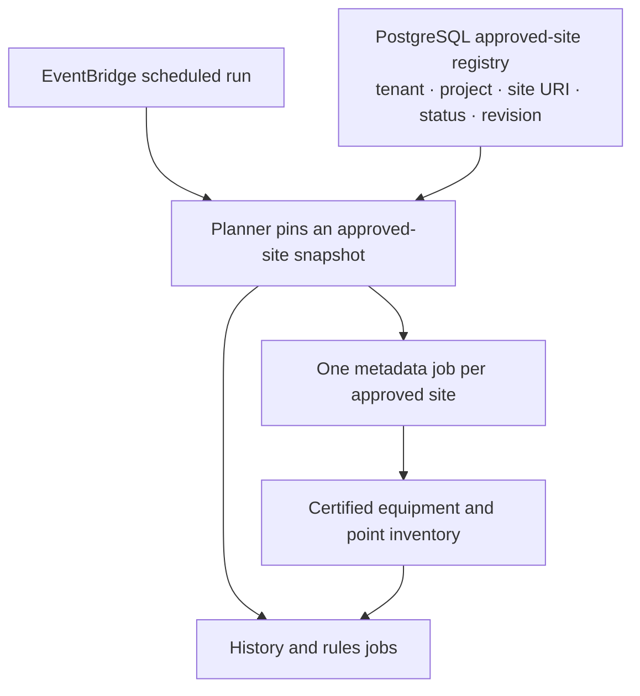

# Database-backed approved-site registry

**Status:** Proposed design; not implemented.

For an estate of roughly 1,000 sites, PostgreSQL can hold the approved site list instead of listing every site in a project binding YAML file. The current implementation reads `approved_sites` from [the binding contract](../src/ingestion/contracts/config.py), so inserting database rows alone would not change what the planner processes.

## Proposed flow

1. An authorized onboarding process adds or changes site records in the approved-site registry. The registry is the authority for tenant, project, site identity, SkySpark site URI, approval status, and revision. A site returned by SkySpark is not approved automatically.
2. At the start of a scheduled run, the planner reads active sites in one consistent database snapshot and saves a `site_snapshot_id` or revision with the run and its jobs. A site change during processing cannot alter that run's scope. Replay uses the same pinned site snapshot.
3. The metadata feed creates one job per approved site. After every required site job certifies, the publisher produces a versioned inventory containing that site's equipment IDs, point IDs, and eligible historized point IDs.
4. History and rules runs pin an eligible certified inventory version associated with the approved site snapshot. The planner partitions point or equipment IDs into bounded jobs; SQS carries job references, not the full inventory.

Keep schedules, batch limits, reader and validator choices, and sink selection in versioned configuration. Move only the approved site roster to the database. Equipment and point IDs continue to come from the certified metadata inventory.

## Changes required in this project

- Replace the binding's `approved_sites` map with a registry reference or resolver, and define a versioned approved-site table and an authorized update process.
- Update the planner and job records to pin the site snapshot used for each run.
- Update metadata publication and inventory validation to compare against that pinned snapshot rather than the current binding's site set.
- Keep tenant/project isolation, source provenance, replay behavior, and fail-closed behavior when the registry or inventory is missing or inconsistent.

The existing planner currently iterates over `approved_sites` in [`core/planner.py`](../src/ingestion/core/planner.py), and the S3 inventory reader requires its sites to match that binding in [`adapters/aws/inventory.py`](../src/ingestion/adapters/aws/inventory.py). Those checks must change together.

A database-backed site registry does not resolve the separate production prerequisite: live SkySpark metadata must provide trustworthy query-completeness evidence before equipment and point inventories can be certified. The current [implementation status](implementation-progress.md) records that gate, along with the pending AWS sandbox deployment.
