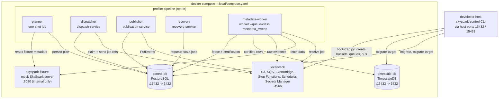
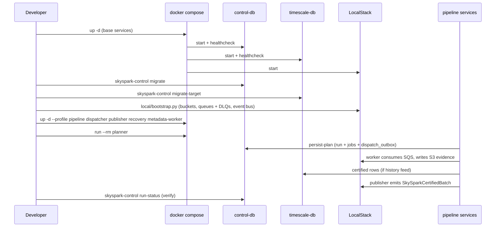
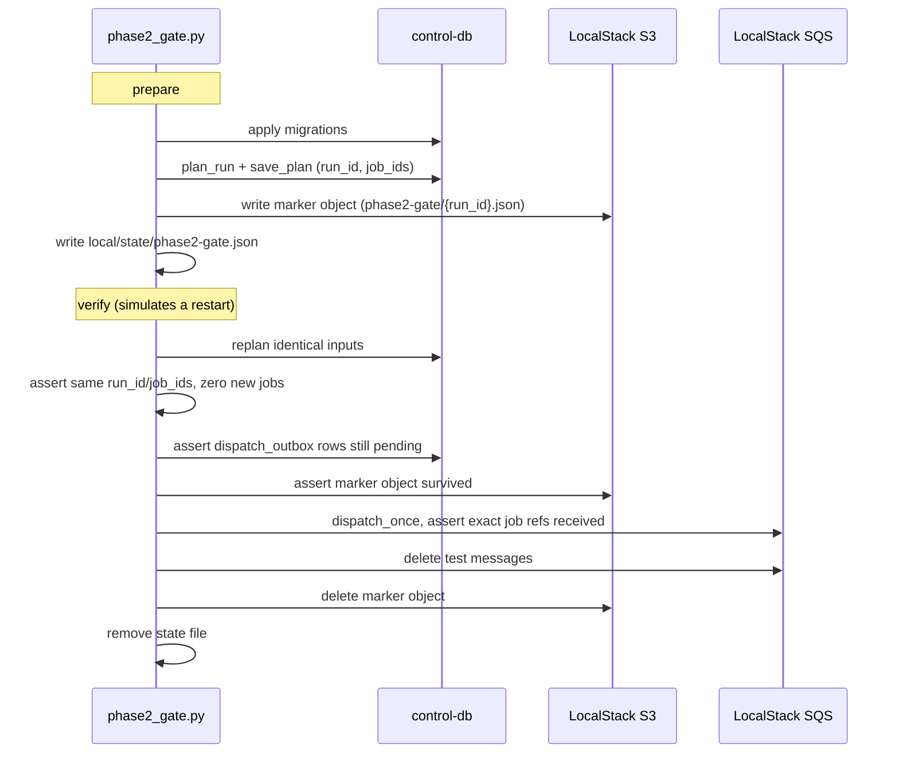

# Local Development Architecture

**Status:** Reference documentation, derived from the current codebase
**Scope:** How the SkySpark ingestion worker platform runs on a developer machine using Docker Compose and LocalStack. This document describes what the code and configuration actually implement today, not a future or planned state.
**Companion document:** [aws-production-architecture.md](aws-production-architecture.md) describes the equivalent AWS deployment.

## 1. Purpose of the local stack

The local stack exists to prove the full pipeline — planning, dispatch, worker execution, certification, and recovery — without any AWS account. It substitutes LocalStack for SQS, S3, EventBridge, Step Functions, Scheduler, and Secrets Manager, and substitutes two local PostgreSQL containers for the control store and the TimescaleDB target. A fixture HTTP server stands in for a real SkySpark source.

Every AWS-facing adapter in `src/ingestion/adapters/aws/` accepts an `endpoint_url`. The CLI supplies this from the `AWS_ENDPOINT_URL` environment variable only when `--environment local` is passed; otherwise the adapters talk to real AWS. This single switch is what makes the same code path run identically in both contexts.

## 2. Service topology

Four services start by default: `localstack`, `skyspark-fixture`, `control-db`, and `timescale-db`. The five pipeline services (`planner`, `dispatcher`, `publisher`, `recovery`, `metadata-worker`) require the `pipeline` Compose profile and are opt-in, so a developer can bring up just the data stores and LocalStack to run CLI commands directly from the host.

## 3. Service inventory

| Service | Image | Host port | Role |
| --- | --- | --- | --- |
| `localstack` | `localstack/localstack:2026.8.2` | `4566` | Emulates S3, SQS, EventBridge, Step Functions, Scheduler, and Secrets Manager |
| `skyspark-fixture` | project-supplied, digest-pinned Python base image | none published (internal `8080`) | Serves a static SkySpark metadata/history fixture over HTTP, with a `/health` check |
| `control-db` | `postgres` (digest-pinned) | `15432` | Control-plane schema: runs, jobs, leases, checkpoints, outbox |
| `timescale-db` | `timescale/timescaledb` (digest-pinned) | `15433` | Certified history target schema |
| `dispatcher` | built from `Dockerfile.control` | — | Sends dispatch-outbox rows to SQS as job references |
| `planner` | built from `Dockerfile.control` | — | One-shot: plans a metadata run against the fixture and persists it |
| `publisher` | built from `Dockerfile.control` | — | Sends publication-outbox rows to EventBridge as certified-batch events |
| `recovery` | built from `Dockerfile.control` | — | Requeues jobs whose lease expired or that were never picked up |
| `metadata-worker` | built from `Dockerfile.worker` | — | Polls the `metadata_sweep` SQS queue and executes registered scripts |

Named volumes (`localstack-data`, `control-data`, `timescale-data`) persist state across container restarts, which is what allows the crash-recovery proof described in Section 5 to work.

## 4. Bootstrap sequence

Steps, in order:

1. Copy `local/.env.example` to `local/.env` and set `LOCALSTACK_AUTH_TOKEN`, `CONTROL_DB_PASSWORD`, `TARGET_DB_PASSWORD`, and `PYTHON_BASE_IMAGE` (a digest-pinned base image; none is supplied by the repository).
2. `docker compose --env-file local/.env -f local/compose.yaml up -d` starts the four base services.
3. Apply schema migrations from the host against the published ports: `skyspark-control migrate --migrations migrations/control` and `skyspark-control migrate-target --migrations migrations/target`.
4. Run `local/bootstrap.py` against the LocalStack endpoint. This script refuses to target anything other than `localhost`/`127.0.0.1`/`localstack`, then creates the three S3 buckets from `local/resources.yaml`, enables versioning on the certified bucket, creates a dead-letter queue and primary queue with a redrive policy for each of the four work queues, and creates the EventBridge bus used for certified-publication events.
5. Bring up the `pipeline` profile services, then run the one-shot `planner` container, which plans a small metadata run (two sites) against the fixture server and persists it to the control store.
6. Tail logs and confirm certification with `skyspark-control run-status`.

An alternative, container-free path is documented in `local/README.md`: run every `skyspark-control` subcommand directly from the host against the published database ports, without the `pipeline` profile at all. This is the fastest loop for iterating on control-plane logic.

## 5. Resource configuration (`local/resources.yaml`)

This file is the single source of truth for bucket names, queue names, feed-to-queue routing, and every bounded policy the workers and control services obey. It is validated at load time by the `ResourceConfig` Pydantic model in `src/ingestion/contracts/resources.py`, which enforces that all three feeds (`history`, `rules`, `metadata`) route to a declared queue and that the storage buckets referenced elsewhere in the file are a subset of the declared bucket list.

Key bounded values relevant to local testing:

| Policy | Value | Effect |
| --- | --- | --- |
| `dispatch.batch_limit` | 100 | Maximum jobs claimed per dispatch cycle |
| `worker.job_slots` | 4 | Concurrent jobs one worker container processes |
| `worker.sqs_batch_size` | 4 | Messages pulled per SQS receive call |
| `recovery.expired_running_after_seconds` | 900 | A running job is considered stale after 15 minutes without a lease renewal |
| `recovery.never_started_after_seconds` | 604800 | A dispatched-but-unclaimed job is requeued after 7 days |
| `max_receive_count` | 4 | SQS deliveries before a message moves to its dead-letter queue |
| `storage.max_raw_bytes` / `max_certified_bytes` | 64 MiB each | Caps per-job evidence and certified-output size |

## 6. Crash-recovery proof (`local/phase2_gate.py`)

This script is the concrete, automated demonstration that the transactional outbox pattern survives a mid-flight failure. It runs in two stages:

`prepare` plans one metadata run, persists it, and drops evidence of that plan into S3 and a local state file, deliberately stopping short of sending anything to SQS. `verify` — standing in for a restarted process — replans the identical inputs and asserts the plan is byte-for-byte identical with zero new jobs created, proving the planner's content-addressed identity scheme is deterministic. It then confirms the outbox rows are untouched, dispatches for the first time, and asserts SQS receives exactly the expected job references before cleaning up. A `--db-only` flag skips the S3 and SQS assertions for faster iteration.

## 7. Command-line entry points used locally

| Command | Purpose | Touches AWS/DB? |
| --- | --- | --- |
| `skyspark-ingestion validate-config` / `plan` | Pure, deterministic config resolution and planning preview | No |
| `skyspark-control migrate` / `migrate-target` | Applies schema migrations | Control DB / Target DB |
| `skyspark-control persist-plan` | Plans and commits a run, its jobs, and outbox rows in one transaction | Control DB |
| `skyspark-control dispatch-once` | Sends one bounded batch of job references to SQS | Control DB, SQS |
| `skyspark-control worker` | The actual job-processing loop (also the ECS entrypoint) | Control DB, Target DB, SQS, S3 |
| `skyspark-control publish-once` | Sends one bounded batch of certification events to EventBridge | Control DB, EventBridge |
| `skyspark-control recover-stale` | Requeues jobs whose lease expired or that never started | Control DB |
| `skyspark-control run-status` | Read-only status check for a run | Control DB |
| `skyspark-source-probe` | Explicit, read-only pilot probe against a real SkySpark source; writes a report file and makes no ingestion side effects | Secrets Manager (AWS only, no LocalStack override) |

## 8. What local development does not simulate

LocalStack's Scheduler emulator stores schedule definitions but does not fire them. There is no local equivalent of the EventBridge Scheduler triggering a Step Functions execution end to end. Local testing instead invokes the planner logic and the Step Functions-equivalent state transitions directly through the CLI and the `pipeline` Compose services. The full scheduled trigger chain is only exercised in AWS; see [aws-production-architecture.md](aws-production-architecture.md), Section 4.
