# SkySpark ingestion worker: detailed implementation plan

**Status:** Reviewed implementation plan; work is in progress. See `implementation-progress.md` for tested slices and open phase gates.  
**Date:** 26 September 2026  
**Implementation root:** `C:\Projects\sajid-projects\ai-skyspark-data-worker-processor`  
**Protected reference folder:** `orginal-scripts/` (retain its spelling and files unchanged).  
**Architecture reviewed:** `skyspark-ingestion-architecture.md`, draft dated 26 September 2026. The AWS design is proposed, not a deployed capability.

The reviewed scripts are `get_skysparkentitydata.py`, `get_skysparkrulespark.py`, and `get_skysparktimeseriesdata.py`. Their filesystem modification dates are 24 September 2026; the files expose no separate revision identifier. The four supplied `fsk=1001` CSV exports are sample source evidence, not production coverage or schedules.

## 1. Review conclusions that shape the implementation

1. **Prove the SkySpark access pattern before sizing workers.** The current history script selects random points and calls `hisRead` one point at a time. The current rules script runs one site-wide `readAll(equip).ruleSparks(...)` expression. Neither script demonstrates bounded multi-ID queries, pagination, complete equipment query coverage, or a source-side completion token. These are source-contract gates, not details to infer from CSV output.
2. **Treat the estate numbers as load hypotheses.** At 1,000 sites × 200 equipment/site × 50 points/equipment, there are about 10 million points. Size the upper-bound history case with all points (100%) eligible: 10 million point IDs, 20,000 initial 500-ID jobs per five-minute cycle, and **5.76 million history jobs/day** before retry or splitting. This also implies about 5.76 million raw objects/day if there is one raw object/job. The sample has `his` set on 2,715 of 2,716 points; only a certified estate inventory establishes actual eligibility. A 100-task × 4-slot history service would need a worker-only ideal mean of at most six seconds/job, before source and sink overhead. Use measurements to decide job size, concurrency, retention, and object layout.
3. **Keep the trust boundary explicit.** The scripts refer to a connector outside this project. That connector currently contains an embedded credential. Do not copy it into the new package or fixtures. Have its owner rotate the credential, then use a secret reference and an approved project/site registry. The user selected `http://44.221.91.30:8888/api/` as the source root; store it in the approved binding, not processing code. HTTP sends credentials and source data unencrypted in transit, which is the accepted transport constraint for this project. A filename or `fsk` value is not authority to read a site.
4. **Clarify two queue counts.** The architecture's four work queues plus four matching DLQs equal eight **worker** queues. A separate shared EventBridge Scheduler delivery DLQ is recommended for failed state-machine invocations; if selected, the infrastructure has **nine queues**. This is distinct from job failure DLQs.
5. **Separate local proof from AWS proof.** Run worker containers directly under Docker Compose against LocalStack SQS/S3 and local PostgreSQL/TimescaleDB. LocalStack's Scheduler APIs currently mock definitions but do not fire targets; start a local Step Functions execution or the planner explicitly. The AWS sandbox must prove the actual Scheduler, IAM, Fargate networking, and autoscaling path. [LocalStack Scheduler limitations](https://docs.localstack.cloud/aws/services/scheduler/); [AWS Scheduler to Step Functions](https://docs.aws.amazon.com/step-functions/latest/dg/using-eventbridge-scheduler.html).

## 2. Implementation order

```mermaid
flowchart LR
  source["0 Source proof and credential repair"]
  contracts["1 Contracts and configuration"]
  local["2 Local services and control store"]
  engine["3 Worker engine and raw S3"]
  metadata["4 Metadata inventory"]
  history["5 Five-minute history"]
  rules["6 Nightly equipment rules"]
  sinks["7 Certified sinks and recovery"]
  scripts["8 Registered script runner"]
  orchestration["9 AWS orchestration"]
  pilot["10 Capacity pilot and rollout"]
  source --> contracts --> local --> engine --> metadata
  metadata --> history
  metadata --> rules
  history --> sinks
  rules --> sinks
  sinks --> scripts --> orchestration --> pilot
```



History and rules can proceed in parallel after certified metadata inventory exists. Every phase ends in a reviewable change with its stated evidence; no production deployment is implied by passing local tests.

## 3. Proposed repository layout

```text
ai-skyspark-data-worker-processor/
  orginal-scripts/                  # unchanged source references
  pyproject.toml                    # pinned Python package and tools
  Dockerfile                        # same image, command selects role
  src/ingestion/
    cli.py                          # plan, worker, dispatch, reconcile, replay, run-script
    contracts/                      # config, job, batch, artifact, receipt schemas
    config/                         # profile loader, binding resolver, validation
    ports/                          # source, sink, queue, control, script protocols
    registry/                       # approved reader, validator, sink, script IDs
    core/                           # planner, worker pipeline, coverage, checkpoints
    adapters/skyspark/              # connection, metadata, history, rules, parsing
    adapters/aws/                   # SQS, S3, Secrets Manager, telemetry
    adapters/db/                    # control PostgreSQL and TimescaleDB sinks
    adapters/scripts/               # isolated registered-script execution
  migrations/control/              # control database schema
  migrations/target/               # TimescaleDB target schema
  config/profiles/                 # reusable feed policies
  config/bindings/                 # approved tenant/project/site bindings
  config/manifests/                # plugin and script manifests
  infra/terraform/                # versioned AWS infrastructure
  local/                          # Compose, LocalStack setup, source fixture
  tests/unit/
  tests/integration/
  tests/acceptance/
  docs/                           # source contract, runbooks, decision records
```

Use a Python CLI for all background roles. The package can coexist with a FastAPI application, but no HTTP route or API server is needed for ingestion. Proposed libraries are Pydantic for immutable contracts/configuration, `boto3` for AWS adapters, the verified Haystack client behind a source port, `psycopg` plus Alembic for database work, PyArrow for bounded Parquet batches, and pytest for verification. Pin compatible versions after the source-client compatibility test. Infrastructure uses Terraform modules; environment-specific values live in validated configuration, not worker branches.

## 4. Original-script reuse map

| Protected script | Logic to port into new files | Behavior to replace |
| --- | --- | --- |
| `get_skysparkentitydata.py` | Equipment/point read intent and Haystack value parsing into `adapters/skyspark/metadata.py` and `parsing.py`. | CSV output, default site filters as implicit scope, whole-site in-memory frame as a completeness guarantee. |
| `get_skysparktimeseriesdata.py` | Point reference normalization and `hisRead` response interpretation into `adapters/skyspark/history.py`. | Latest-CSV lookup, random `sample_size`, `yesterday` range, sequential point loop, broad exception-and-continue, combined frame/CSV output. |
| `get_skysparkrulespark.py` | Axon call/error-grid handling and rule field mapping into `adapters/skyspark/rules.py`. | Unrestricted expression override, site-wide query as assumed equipment coverage, CSV output, treating triggered rows as proof of queried equipment. |

The shared connector under `C:\Projects\src\src\connectors\skyspark.py` is a dependency to examine, not code to copy wholesale. An approved new connector must honor passed credentials or a Secrets Manager reference and must never embed a default identity or password.

## 5. Phase-by-phase code steps and gates

### Phase 0 — Source contract and safe starting point

1. Establish the new project root beside `orginal-scripts/`; record original file hashes. The folder is not currently a Git repository, so confirm its intended remote and branch before initializing source control. Inspect the four supplied `fsk=1001` CSVs read-only, then derive sanitized synthetic fixtures for version control; do not commit the source exports. Confirm the real tenant → SkySpark project → authorized site mapping; `fsk=1001` is an example label until the registry validates it.
2. Obtain credential rotation from the credential owner. Define local dummy credentials for fixtures and production secret references. Add a repository secret scan before any commit or image build.
3. Build a small read-only source probe, separate from the production worker, against one approved project. Capture whether point history accepts multiple IDs and exact UTC windows; whether `readAll` can page or partition; whether rule output can be queried by equipment IDs; response caps/truncation markers; zero-result semantics; request limits; and correction/closure identity.
4. Record a source contract with example requests, response shapes, permissions, and measured latency/size. If batch history or complete rule queries are unavailable, revise partition policy or request a source-side bulk export before scaling code.

**Gate:** The data provider and data consumer agree on the three query contracts, credential path, authorized scope, and one pilot project. No estate-wide concurrency setting is approved yet.

**Acceptance note (28 September 2026):** The user accepted Phase 0 for implementation progression based on the live pilot evidence in `source-contract-status.md`. Unresolved production decisions in Section 6 are carried forward; acceptance is not a source-completeness or capacity certification.

### Phase 1 — Package, immutable contracts, and config resolver

1. Create `pyproject.toml`, `src/ingestion/cli.py`, the `contracts/`, `ports/`, `config/`, and `registry/` packages, a minimal Dockerfile, and unit-test configuration. A single image exposes role commands such as `plan`, `worker --queue history_live`, `dispatch`, `reconcile`, and `run-script`.
2. Define typed, versioned `PipelineConfig`, `SourceBinding`, `Run`, `Job`, `SourceBatch`, `RawArtifact`, `Certification`, and `SinkReceipt` contracts. Pin tenant/project/site identities, feed, half-open UTC window, plugin IDs/versions, config hash, schema version, and trace ID. Unknown fields and incompatible reader/validator/sink combinations fail validation.
3. Resolve a reusable profile plus approved project binding into an immutable effective config. Logical queue/bucket names resolve through environment configuration; credentials resolve only at runtime from the secret provider. Allow only registered query templates and script IDs, never arbitrary Axon text, import paths, or shell commands from a job payload.
4. Define deterministic run and job identity from trusted scope, feed, partition, window, and config version. A delivery attempt has a different attempt ID but cannot change the job's requested scope.

**Gate:** Config tests reject an unapproved site, unknown plugin, invalid time window, credential in payload, and sink/feed mismatch. Re-loading the same pinned config produces the same hash and job identities.

### Phase 2 — Docker harness and PostgreSQL control state

1. Create `local/compose.yaml` with LocalStack, a SkySpark fixture server, planner/dispatcher/worker containers, PostgreSQL control store, and a separate TimescaleDB container. Use named volumes for local S3 emulator state and both databases; keep tokens and passwords in uncommitted environment/secret inputs. `localhost:4566` is the AWS API endpoint for host tools, not a web preview.
2. Create LocalStack S3 buckets/prefixes and four work queues with four DLQs. Seed a fixture project and bounded metadata/history/rule responses. Run workers as ordinary Docker containers so local tests do not depend on ECS emulation.
3. Add control migrations for `pipeline_version`, approved binding, `run`, `job`, `job_child`, `attempt`, `lease/fence`, expected-scope reference, artifact, certification, checkpoint, sink receipt reference, dispatch outbox, publication outbox, and replay request. Include tenant/project columns in keys and indexes. Partition or age high-volume run/job tables according to measured retention needs.
4. Implement the control repository with one transaction for job creation plus queue-dispatch intent, unique job keys, lease compare-and-swap, and a reconciler for unsent intents and stale jobs.

**Gate:** Restarting any local container preserves committed state; a crash after job creation but before SQS send is recovered by dispatch reconciliation, without creating duplicate jobs.

**Local acceptance (28 September 2026):** The `local/phase2_gate.py` prepare/restart/verify run passed with a disposable PostgreSQL control database and live LocalStack. Two pending jobs and their outbox intents survived the control container restart, an S3 marker survived the LocalStack restart, replanning created zero jobs, and dispatch delivered two SQS references. The TimescaleDB schema and source fixture also survived restarts. A separate isolated container smoke run produced two certified synthetic metadata jobs. The source fixture serves bounded JSON grids and does not emulate the Haystack wire protocol; production feed readers remain later-phase work.

### Phase 3 — Generic queue worker, batching, and raw evidence

1. Implement SQS long polling for **job references**. On receipt, fetch trusted scope/config from the control store, acquire a fenced lease, obtain a per-project source permit, and run the same stage pipeline for every feed. One ECS task will later be one worker container; a configurable slot is one concurrently admitted job, not a mandated thread.
2. Use bounded asynchronous orchestration around the existing synchronous Haystack client through a bounded executor, if that client remains synchronous. Cap jobs/task, SkySpark calls/project, target writes/task, bytes/batch, and memory. Keep source calls and CPU-heavy parsing in separate bounded pools only when measured need supports it.
3. Stream or spool bounded source responses to immutable LocalStack/AWS S3 raw objects with checksum, query scope, response metadata, and manifest. Classify throttling/timeouts as retryable; schema/cap failures as split-or-quarantine; access errors as source-pause. Extend SQS visibility while work is active and delete the message only after durable certification.
4. Implement an S3 certified sink first, with deterministic object keys, Parquet or another reviewed typed format, manifest/receipt checks, and restart-safe commit ordering. Persist child jobs before a parent is considered complete. Add queue failure routing and DLQ redrive tests.

**Gate:** Tests prove duplicate SQS delivery, stale-worker fencing, a worker kill after raw upload, retry exhaustion, and a response near the configured source cap. SQS standard queues require idempotent processing because delivery is at least once. [AWS SQS delivery](https://docs.aws.amazon.com/AWSSimpleQueueService/latest/SQSDeveloperGuide/standard-queues.html).

**Local acceptance (28 September 2026):** The Phase 3 resilience suite passed against a disposable PostgreSQL database and live LocalStack. It killed a worker process after immutable raw upload, recovered the same job after visibility/lease expiry, verified stale fencing and duplicate acknowledgment, exhausted a queue into its DLQ, manually redrove a checked job reference, and tested an exact raw-byte cap plus terminal quarantine for an oversized response. A rebuilt Docker metadata worker also certified two fresh synthetic jobs. Reviewed scripts now use exit code 65 for a nonretryable partition; the worker commits a fenced quarantine before acknowledging its SQS reference. Production Haystack readers, source access pause policy, and source-specific child splitting remain for the following feed phases.

### Phase 4 — Metadata reader and certified inventory

1. Port equipment and point extraction into `adapters/skyspark/metadata.py`. Start with a site partition, but split or use source paging when a site response is too large. Preserve original Haystack tags and stable source IDs before creating relational links.
2. Validate site/equipment/point references against the approved registry. Classify site-level points separately from unresolved equipment references; do not drop the six sample points lacking `equipRef` without a rule. Certify a complete snapshot only after all required source pages/partitions succeed.
3. Publish an inventory version that the other feeds pin when planning. Compute actual history eligibility from certified `his` tags and approved exclusions, not an assumed percentage. Record adds/changes; issue tombstones only when the source contract supports reliable deletion evidence.

**Gate:** A local read-only check of the supplied `1001` exports reports 250 equipment and 2,716 points with explicit classification of missing references; CI uses sanitized synthetic fixtures. A partial metadata response cannot remove prior inventory or silently shrink later history/rule scope.

**Local acceptance (28 September 2026):** The bounded metadata reader, reviewed HTTP contract-fixture script, and PostgreSQL/S3 inventory publisher passed the Phase 4 gate. The reader requires one stable snapshot token and complete page receipts for equipment and points, preserves Haystack tags and site-level points, validates links, and rejects oversized or partial reads. The publisher verifies every certified site job and physical S3 evidence, records adds/changes, rejects unexplained scope shrinkage, applies configured history exclusions, and writes an exact-version inventory used by scheduled history/rules planning. The Step Functions definition invokes an inventory Lambda only after metadata coverage certifies; its Terraform root validates locally. A Docker smoke run certified two metadata jobs and published 3 equipment and 3 points. The supplied `1001` CSV assessment remains read-only: 250 equipment, 2,716 point IDs, five accepted site-level points, and one point without `siteRef`. Live SkySpark `readAll` grids still lack source completeness/page receipts, so production metadata certification and tombstones remain blocked on the data-provider contract. Larger inventory publication needs the Phase 10 capacity gate.

### Phase 5 — Five-minute point history

1. Implement the history planner from certified eligible point IDs, scoped by project and site, using an approved initial start, contiguous checkpoint, configured source lag/lookback, and exact half-open UTC windows such as `[10:00Z,10:05Z)`. Start with 500 IDs/job only as a pilot default; replace it if Phase 0 disproves efficient batch reads.
2. Port point reference normalization and response parsing. Preserve source timestamp, time zone, typed value/status, point ID, query ID, and raw checksum. Process responses in bounded batches; never select random points, load the latest CSV as inventory, or swallow an individual point error.
3. If the source returns too much data or a cap/timeout, persist deterministic child jobs by ID group or time subwindow. Distinguish a complete query with no observation from an incomplete query. Accept change-of-value histories without inventing expected fixed-interval rows.
4. Validate returned IDs and timestamps against the requested scope. Advance a point/site checkpoint only across contiguous certified windows, with explicit gaps available for replay.

**Gate:** Local tests cover a full five-minute window, valid empty result, late/corrected observation, cap split, failed child, duplicate delivery, and a source outage. The full eligible set is planned exactly once per due window.

**Local acceptance (28 September 2026):** The reviewed fixture history script and bounded reader passed the Phase 5 gate against isolated LocalStack S3 and TimescaleDB resources. Complete source receipts cover all requested point IDs and the exact half-open window even when there are zero observations. Source lag and bounded lookback are reviewed binding values (`history_source_lag_minutes`, `history_lookback_windows`); the scheduled workflow waits for every planned lookback run. A cap or timeout persists two deterministic child jobs by ID, then time, under a live worker fence. A split parent has no certification; all leaf jobs must certify before the contiguous site checkpoint advances. Corrected values are recorded in an append-only revision table when `history_correction_policy: append_revision` is selected; the original observation remains the base row until the provider supplies revision ordering. The full local suite passed 144 tests. The observed live SkySpark history grid has no complete-query or truncation receipt, so the production adapter must remain fail-closed until the provider contract is available. Phase 10 must size the selected 500-ID cap, lag, and lookback from measured load.

### Phase 6 — Nightly equipment rule output

1. Plan from **every authorized certified equipment ID** each night. Start with 200 IDs/job as a tunable default, but use the equipment-scoped query mechanism proven in Phase 0. Define the nightly source interval and time zone explicitly; the old `yesterday` expression is insufficient as a production cursor.
2. Port rule field mapping, including `targetRef`, `ruleRef`, source date/time zone, spark, duration, periods, points, priority, and severity. Record a successful query receipt for each requested equipment set even when it returns zero detections.
3. Design stable detection identity and revisions from actual source behavior. Reconcile overlap for late/corrected outputs. Do not mark a prior detection closed solely because one nightly response omitted it unless closure semantics were confirmed.

**Gate:** The sample's 37 detection rows resolve to equipment, while the coverage report separately accounts for all 250 requested equipment. A missing or truncated query blocks only its affected equipment partition.

**Local implementation (28 September 2026):** The scheduled planner selects one complete source-local calendar day using the binding's `rules_source_timezone` and `rules_settlement_minutes`, then replans up to `rules_lookback_days` earlier days for late or corrected output. The reviewed local reader queries certified equipment IDs in 200-ID jobs, verifies exact project/site/day/time-zone/window and requested/completed-ID receipts, and writes immutable raw and candidate JSONL objects to S3. A complete response with zero rows certifies all requested equipment IDs. A partial, truncated, mismatched, or duplicate-identity response is rejected. Each candidate preserves source fields, has a provisional key derived from tenant/project/site/equipment/rule/day/source time zone, and a separate hash of the full row for corrections; a second row with the same key in one query fails closed until the data provider specifies stable detection IDs. Lookback does not infer closure from absence. The synthetic 250-equipment test creates 200/49/1 partitions over two sites; an incomplete partition holds its site checkpoint while the other site advances. The Phase 0 export assessment found all 37 rule rows attached to the sampled 250 equipment. Live SkySpark grids still lack a complete-query receipt, so production rule certification awaits the provider contract. The local reviewed script targets S3; rules-to-TimescaleDB remains a Phase 7 mapping.

### Phase 7 — TimescaleDB sink, certification, replay, and publication

1. Add target migrations for point-history hypertables plus metadata and detection tables. Define keys with tenant/project/source identity and timestamp or revision as supported by the source contract. TimescaleDB unique indexes must include the hypertable partitioning columns. [TimescaleDB unique-index rule](https://docs.timescale.com/use-timescale/latest/hypertables/hypertables-and-unique-indexes/).
2. Bulk load bounded rows with `psycopg` `COPY` into staging, then perform idempotent merge/upsert and commit a unique batch receipt. The `target.kind` flag chooses S3 or TimescaleDB certified output per pinned pipeline version; both retain raw S3 evidence. Keep the control store separate from the high-volume target unless an approved deployment is sized for both.
3. After durable sink success, commit certification, contiguous checkpoint, and publication outbox entry in the control store. On crash/retry, check the deterministic S3 object or TimescaleDB receipt and finish the missing control transaction. Add authorized replay/backfill with its own queue and source/sink budget.
4. Add retention, raw-object lifecycle, table partition aging, and cost measures. The first pilot must report object count and control-row growth as well as bytes and observation throughput.

**Gate:** Kill the worker after sink commit and before control commit; retry must produce one certified logical batch and advance the checkpoint once. Verify both target choices for all three feeds.

**Local implementation (28 September 2026):** Target migration `0004_metadata_rules.sql` adds typed metadata and equipment-rule revision tables, batch rows, and feed-scoped receipts alongside the history hypertable. The reviewed fixture scripts select S3 or TimescaleDB from the pinned feed target; raw evidence always goes to S3. An isolated LocalStack/TimescaleDB test verifies the six feed/target combinations and their physical receipts. The metadata inventory publisher can rebuild the certified planning snapshot from Timescale metadata batches. A rules sink process exits immediately after commit; a retry finds the same deterministic batch, then fenced control certification advances each site cursor once and writes one publication intent per job. A replay requires an active, separately recorded approval grant covering the exact config, inventory version, feed, time window, and job cap. The request audit, jobs, and backfill dispatch intents commit together; repeated request IDs are idempotent. The backfill worker has a reviewed per-project source permit cap and smaller task slot count. A LocalStack EventBridge test verifies accepted event IDs and durable delivery state. Storage measurement reports capped S3 object/byte counts, database relation estimates, and history hypertable bytes. Retention preview renders lifecycle rules only after values are explicitly configured; no expiration or table aging has been applied. Metadata, rule, history-revision, batch, and control-table aging need measured retention decisions and coordinated evidence lifetimes before activation.

### Phase 8 — Registered standalone Python scripts

1. Define an approved script manifest: `script_id@version`, packaged artifact/image digest, accepted job schema, permitted source/sink capabilities, timeout, resource limits, and output contract. The registry resolves the script without feed-specific `if` chains.
2. Invoke packaged scripts through an argument array with no shell interpolation, passing a job-context file or reference rather than credentials on the command line. Run them as an isolated subprocess or separate ECS task according to trust/resource class; reject arbitrary filesystem paths in submitted config.
3. Require every ingestion script to return a bounded artifact and provenance manifest for the common validator/sink stages. A general utility script may run as a tracked job, but cannot mark data certified without that contract.

**Gate:** A registered sample script completes locally; an unknown script ID, invalid output contract, over-time run, or forbidden target is rejected and auditable.

**Implemented local gate, 28 September 2026:** The reviewed manifest now supports explicit reader source/sink capabilities, a bounded file-based job context, and a versioned artifact/provenance result. The runner checks the returned script/config/job identity, target, and full scope before the common physical verifier certifies anything. Earlier local feed fixtures retain their pinned `completion-v1` contract. Registered `utility-context-v1` scripts use the same digest-checked, no-shell subprocess launcher but write only to `ingestion.standalone_script_runs`; they have no certification method. `skyspark-standalone-script` takes a context file and reads the control DSN from a named environment variable. A disposable-database gate records completed, unknown-ID, forbidden-target, invalid-output, and timeout outcomes. Time/output/context limits and source-call slots are enforced locally. The subprocess is for reviewed scripts under the worker's existing OS identity; stronger per-script memory/CPU isolation or a separate task identity requires Phase 9 ECS packaging. Live SkySpark readers still require provider-complete query receipts before production certification.

### Phase 9 — AWS scheduling, ECS services, security, and observability

1. Add Terraform modules for ECR, S3, SQS/DLQs, Step Functions Standard, EventBridge Scheduler, ECS cluster/task definitions/services, Secrets Manager references, IAM/KMS, VPC connectivity, CloudWatch dashboards/alarms, and scaling policies. Provision four independent worker services, one per work queue; start task counts and slots from pilot configuration, not from the illustrative 100/10/5/5 split.
2. Reconcile schedule definitions from approved project/feed bindings: history every five minutes, rules nightly, metadata on a slower configurable cadence. Under the illustrative 200-project model, this means 600 definitions, but actual project count comes from onboarding. The scheduled input carries project/feed/config reference and due time. Step Functions invokes a bounded planner task, waits on durable run status, and reports partial or blocked coverage; workers remain long-running queue pollers.
3. Scale ECS services using backlog **per running task**, queue age, certification lag, source permits, and sink pressure. Add task-draining behavior for active messages and explicit maximum task counts. [AWS ECS queue scaling guidance](https://docs.aws.amazon.com/AmazonECS/latest/developerguide/service-autoscaling-queue.html).
4. Keep secrets out of configuration, SQS, logs, and image layers. Restrict task identities and S3 prefixes by role and approved tenant/project scope; test cross-tenant denial. Emit correlated run/job/partition metrics and alerts for lag, DLQ growth, source throttle, blocked coverage, and failed publication.

**Gate:** In an AWS sandbox, a real schedule starts one state-machine run, jobs reach the expected queue, Fargate workers certify a bounded pilot, failures reach the correct DLQ/alarm, and an unauthorized scope is denied. LocalStack alone is not the cloud acceptance test.

**Implemented local slice, 28 September 2026:** `infra/foundation/` now plans three versioned, KMS-encrypted private buckets, three immutable ECR repositories, and optional private AWS service endpoints in an existing VPC. The workers root rejects bucket-wide and unapproved tenant/project S3 object prefixes, keeps four services at zero tasks by default, and includes a queue/task dashboard. The orchestration root grants the optional target database secret only to the metadata inventory publisher and adds workflow, Lambda, and Scheduler failure alarms/dashboard. All three Terraform roots validate with AWS provider 6.66.0; mocked Terraform plans pass seven checks without credentials or resource creation. A disposable LocalStack test stores a versioned config object, completes a Standard state machine, and registers three disabled schedules. The full Python suite passes 177 tests with disposable PostgreSQL, TimescaleDB, and LocalStack resources. The AWS sandbox gate above remains open: no images were pushed, resources applied, live schedules enabled, Fargate tasks launched, or IAM/network paths proven. Source throttle, sink pressure, and certification-lag instrumentation require measured AWS pilot behavior before scaling decisions.

### Phase 10 — Measured capacity and controlled rollout

1. Benchmark one site, then one project, then concurrent projects with both live history and backfill. Measure source calls and bytes/job, job duration percentiles, points with results/window, S3 object/byte growth, control DB write rate, TimescaleDB ingest/query behavior, and recovery lag.
2. Recalculate eligible point count, jobs per cycle, minimum required slots, source-call cap, task count, and total cost from measurements. Reject a five-minute rollout if any cohort's certified checkpoint continually falls behind. If bounded REST extraction cannot sustain the objective, request source-side bulk export or revise scope/cadence before adding more tasks.
3. Roll out by approved project cohort, with reversible configuration versioning and isolated backfill budgets. Publish runbooks for source outage, capped response, DLQ redrive, quarantine, credential rotation, sink recovery, and checkpoint replay.

**Gate:** Agreed freshness, completeness, isolation, replay, and cost targets hold under representative sustained load. Record the maximum proven estate size; do not extrapolate the local fixture to 1,000 sites.

## 6. Review decisions carried forward after Phase 0 acceptance

| Decision | Proposed starting position | Why it matters |
| --- | --- | --- |
| Pilot scope | One approved SkySpark project, including its actual site mapping. | Establishes authorization and measured response shape. |
| History batch operation | Use verified multi-ID query if available; otherwise measure a source-side bulk export. | One-point-at-a-time reads may make five-minute coverage infeasible. |
| Rule identity and completion | Require equipment-query receipts plus documented update/closure behavior. | Triggered rows alone cannot prove complete nightly coverage. |
| Target per feed | Metadata/rules to S3 and history to TimescaleDB for the first mixed-sink pilot; test the alternate target for each feed. | Exercises the requested config flag without hard-coding a feed to a sink. |
| Production TimescaleDB host | Choose an approved TimescaleDB-capable deployment and retention policy. | Do not assume an arbitrary managed PostgreSQL service includes the extension. |
| Freshness and retention | Agree on source lag, late-data lookback, raw/control/certified retention, and alert thresholds. | These determine checkpoint logic and storage cost. |
| Scheduler delivery DLQ | Use one shared Scheduler DLQ in addition to eight worker queues. | Separates failed schedule invocation from failed ingestion jobs. |

**Workspace note:** This plan is saved in the implementation project's `docs/` folder. That project is outside the current writable workspace, so later implementation edits require write access. No original script or application code was edited for this plan.
