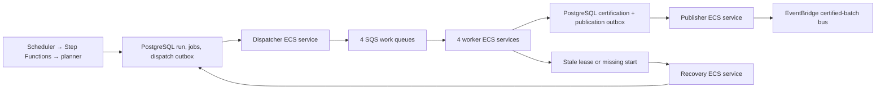

# Shared queue workers: AWS foundation

This Terraform root defines one encrypted SQS work queue and matching DLQ for each reviewed `work_queues` entry, plus one ECS Fargate service per work queue. The example resource file has four work queues, so this creates eight worker queues and four worker services. The separate Scheduler delivery DLQ belongs to `infra/orchestration/`. The S3 buckets, KMS key, and ECR repositories are defined in `infra/foundation/`. Worker services start with **zero tasks** unless `enable_workers=true`; control services are absent unless `enable_control_services=true`. Enable either group only after its image, database, and network inputs have been reviewed.



Workers now load each job's profile, binding, and plugin manifest from the hash-pinned `ingestion.pipeline_versions` row. They verify the job's tenant, project, site, feed, and hash before selecting a script and target. This lets one service consume its queue across projects. The worker image needs the approved script files and reviewed `resources.yaml`, but no project binding baked into the image. The configuration cache is bounded by `worker.config_cache_entries`.

## Inputs

- Build `Dockerfile.worker` from the project root with an approved digest-pinned Python base image, the reviewed `RESOURCE_CONFIG_FILE`, and `SCRIPT_ROOT_DIR` containing only approved scripts. The Terraform `resource_config_file` must be the same YAML packaged at `/app/resources.yaml`. Push the image to an approved ECR repository and pass its digest-pinned URI as `worker_image_uri`.
- Supply existing private subnets and security groups with control DB, TimescaleDB, SkySpark, S3, SQS, and Secrets Manager connectivity. `control_database_secret_arn` and `target_database_secret_arn` must each contain a JSON `dsn`. ECS injects only the `dsn` fields as worker environment variables through its task execution role. `source_secret_arns` maps approved script environment variable names to source secret ARNs; scripts still receive only names declared in their reviewed manifest.
- Supply explicit `approved_scopes` such as `tenant-a/project-a`. Every `raw_object_arns` and `certified_object_arns` entry must use an exact `raw/tenant/project/*` or `certified/tenant/project/*` prefix within those scopes; a bucket-wide `*` fails the plan. Each service task role can consume only its own queue. Pass the foundation object's KMS key ARN through `s3_kms_key_arns` and provide any separate secret key ARNs. Bucket and key policies must also allow the task roles. A shared service can access all **approved** scopes; the job's pinned tenant/project/site checks remain essential.
- Supply `capacity_by_queue` for every queue in the reviewed YAML. For an **illustrative one-project pilot**, a starting review candidate is:

```hcl
capacity_by_queue = {
  history_live   = { cpu_units = 1024, memory_mb = 2048, min_tasks = 1, max_tasks = 4, backlog_target = 12, queue_age_alarm_seconds = 300 }
  rules_nightly  = { cpu_units = 512,  memory_mb = 1024, min_tasks = 1, max_tasks = 2, backlog_target = 12, queue_age_alarm_seconds = 900 }
  metadata_sweep = { cpu_units = 512,  memory_mb = 1024, min_tasks = 1, max_tasks = 2, backlog_target = 12, queue_age_alarm_seconds = 1800 }
  backfill       = { cpu_units = 512,  memory_mb = 1024, min_tasks = 1, max_tasks = 1, backlog_target = 12, queue_age_alarm_seconds = 3600 }
}
```

At the reviewed `worker.job_slots: 4`, these values mean four initial tasks × four slots = 16 job slots, with at most nine tasks × four slots = 36 job slots if scaling is enabled. The per-project PostgreSQL source permit budget still caps simultaneous SkySpark calls. The `backlog_target` values need measured job duration and accepted queue delay; they are not an estate capacity claim.

## Control services

`Dockerfile.control` packages the reviewed `resources.yaml` and shared Python package without source scripts. Supply its approved ECR digest as `control_image_uri`. With `enable_control_services=true`, this root creates a dispatcher, publisher, and stale-recovery Fargate service; `control_capacity` sets their CPU, memory, and task counts. The default candidate is four dispatcher tasks, two publisher tasks, and one recovery task. PostgreSQL claim leases and `SKIP LOCKED` let multiple tasks share each role. Each process drains complete bounded batches immediately and sleeps according to `control_loop` only when a batch is not full. SIGTERM ends the loop after its current batch.

The dispatcher role can send only to the four created work queues. It uses SQS `SendMessageBatch` in groups of at most ten and records each returned message ID; individual failed entries are released with backoff. The publisher role can describe and put events only to the custom EventBridge bus named in `publication.event_bus`, which this root creates. The recovery role has no AWS data permissions; it moves only eligible stale control records back to the dispatch outbox. Their execution roles can read the control database secret's `dsn` key; set `control_database_kms_key_arns` only when that secret uses a customer managed key. CloudWatch alarms report a control service running below its configured task count. No EventBridge consumer rule is created here.

For the **illustrative 2,000-site history cycle**, 40,000 job references would require at least 4,000 SQS batch requests if all succeed with ten references per request. Over five minutes, that is 133 references and 13.3 batch requests per second across dispatchers, before retries and metadata/rules traffic. Four dispatcher tasks would average 33 references per second each. PostgreSQL still confirms each reference separately. These figures are load-test targets, not proven capacity; increase task count, claim lease, and database connection capacity only from measured results. The example's `recovery.never_started_after_seconds` is seven days and must be reviewed against actual SQS retention and queue delay before production.

## Scaling and operations

The scaling policy uses CloudWatch SQS visible messages divided by Container Insights running task count. Container Insights is enabled on the cluster. Maximum tasks are explicit per queue. `worker.scale_in_protection.enabled` is **false** in the local example, so automatic scale-in remains disabled. When a reviewed AWS resource file sets it to `true`, the worker uses the ECS agent endpoint before polling SQS, holds protection across all active slots, refreshes it before expiry, and clears it after the final acknowledgment. Terraform then grants only the worker task role `ecs:GetTaskProtection` and `ecs:UpdateTaskProtection` on tasks in its cluster and enables scale-in. Test that combination in an AWS sandbox before rollout; a local fake-agent test does not prove ECS placement or IAM. SIGTERM initiates a drain, but a task stopped outside normal scale-in can still be interrupted; fenced leases, SQS visibility, and idempotent sinks make a retry safe. A CloudWatch dashboard shows queue backlog, age, DLQ depth, and running tasks. Queue-age and DLQ-depth alarms are defined, but notifications require `alarm_sns_topic_arns`.

For local review, run `terraform init -backend=false`, `terraform fmt -check`, `terraform validate`, and `terraform test`. Mocked tests check four queue/service pairs, zero initial tasks, dashboard/alarms, and rejection of bucket-wide or unapproved-tenant S3 permissions. Use a reviewed remote S3 Terraform backend and inspect `terraform plan` before any apply. Terraform validation checks the provider schema; it does not prove queue throughput, networking, IAM access, or source query completeness. The default plugin manifest has no production script entrypoints. LocalStack and an AWS sandbox still need end-to-end tests. No resources from this root have been applied.

The [AWS ECS SQS scaling guidance](https://docs.aws.amazon.com/AmazonECS/latest/developerguide/service-autoscaling-queue.html) describes the backlog-per-running-task metric and task protection. [ECS Secrets Manager guidance](https://docs.aws.amazon.com/AmazonECS/latest/developerguide/secrets-envvar-secrets-manager.html) describes the injected JSON-key secret format.
[SQS batch actions](https://docs.aws.amazon.com/AWSSimpleQueueService/latest/SQSDeveloperGuide/sqs-batch-api-actions.html) permit up to ten references per send request and require checking each entry result.
[ECS task protection](https://docs.aws.amazon.com/AmazonECS/latest/developerguide/task-scale-in-protection.html) documents the agent endpoint, expiry, and task-role permissions.
